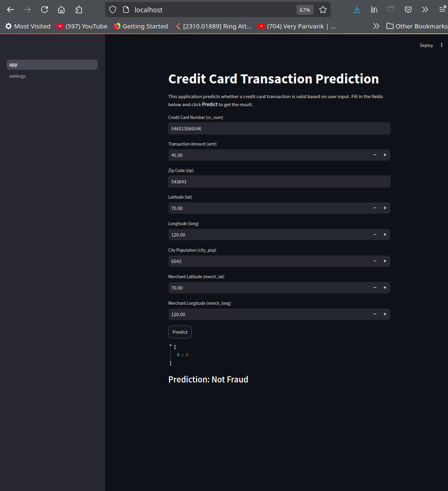
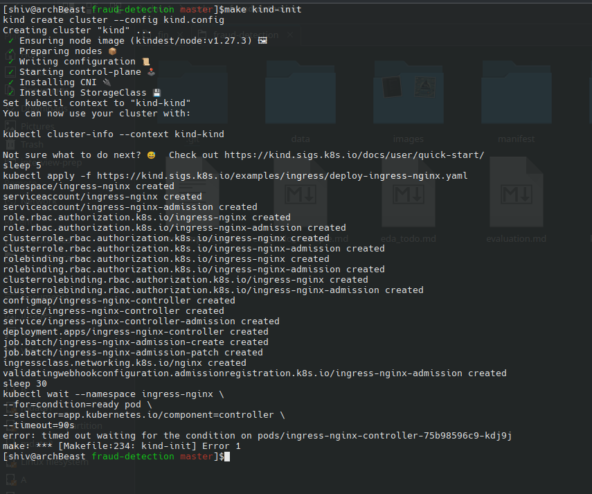
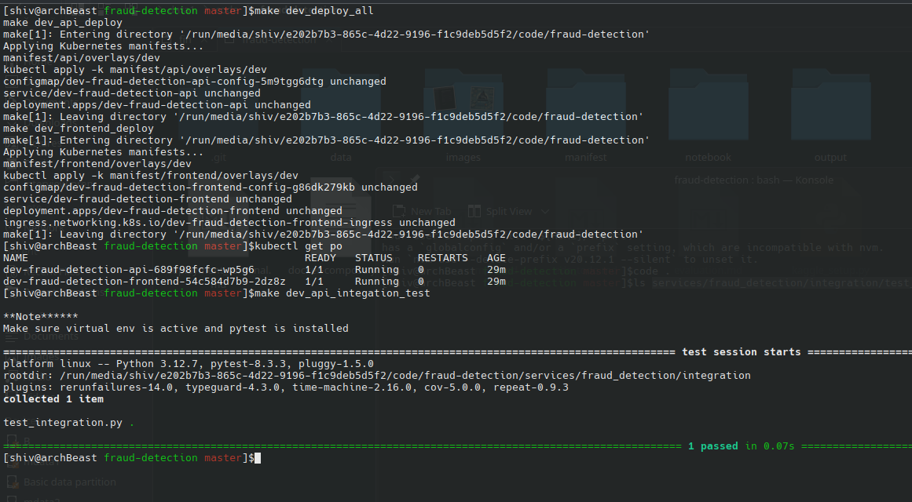
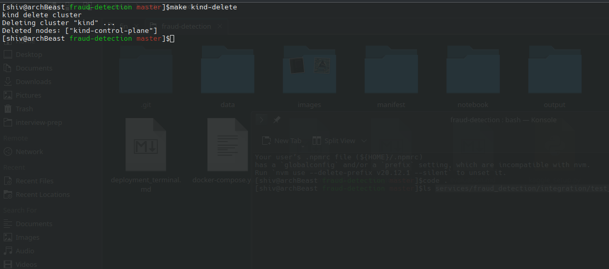

# Fraud Detection Project


## Table of Contents
1. [Overview](#overview)
2. [Problem Statement](#problem-statement)
3. [Dataset Description](#dataset-description)
4. [Objective](#objective)
5. [Project Directory](#project-directory)
6. [Setup](#setup)
    1. [Model Development](#model-development)
        - [EDA Setup](#eda-setup)
        - [Training Model](#training-model)
    2. [Deployment](#deployment)
        - [Run Locally](#run-locally)
        - [Run using Docker Compose](#run-using-docker-compose)
        - [Run using Kubernetes](#run-using-kubernetes)
    3. [Build Deployment Using Makefile](#build-deployment-using-makefile)
7. [Model Report](#model-report)
8. [Architecture](#architecture)
9. [Screenshots](#screenshots)
10. [Future Work](#future-work)
11. [Project Evaluation](#project-evaluation)

---

## Overview

Fraud detection is a critical aspect of ensuring the integrity and trustworthiness of transactions in industries like finance, e-commerce, and banking. This project aims to build a machine learning model that can accurately classify transactions as either legitimate or fraudulent.

The goal of the project is to create an automated fraud detection system that can predict fraudulent transactions based on historical data.

---

## Problem Statement

With the rise in online transactions, financial institutions face an increasing challenge of identifying fraudulent transactions. Fraudulent activities lead to significant financial losses, reputation damage, and legal consequences.

This project addresses the problem by building a machine learning model capable of automatically classifying transactions as fraudulent or non-fraudulent using historical transaction data.

---

## Dataset Description
kaggle dataset: [fraud-detection](https://www.kaggle.com/datasets/kartik2112/fraud-detection/data)

The dataset for this project is `fraudTrain.csv`, which contains transaction data with various features. These features are used to train the model to identify patterns associated with fraudulent behavior. The dataset includes:

- **Features**: Various transaction attributes, including transaction amount, customer data, and timestamps.
- **Labels**: The target column, where `1` indicates a fraudulent transaction and `0` indicates a legitimate transaction.

---

## Objective

The main objective of this project is to develop a machine learning model to automatically detect fraudulent transactions. The project consists of the following steps:

1. **Data Preprocessing**: Clean and prepare the dataset for modeling.
2. **Model Development**: Train and fine-tune various machine learning models.
3. **Model Evaluation**: Evaluate the model’s performance using appropriate classification metrics.
4. **Deployment**: Deploy the model for real-time fraud detection.

---

## Project Directory

The project directory is structured as follows:

## Project Directory
```
├── data                      # contains data (Download from kaggle)
│   ├── fraudTest.csv
│   ├── fraudTrain.csv
├── notebooks
│   ├── eda
│   │   ├── eda.ipynb         # Exploratory Data Analysis notebook  
│   ├── modeling
│   │   ├── train_v6.py       # Hyperparameter tuning script  
│   └── requirements.txt
├── output                    # output of model training script is saved here
├── services
│   ├── fraud_detection
│   │   ├── api
│   │   │   ├── api.py
│   │   │   ├── models        # dir for models for deployment
│   │   │   │   └── best_model.pkl  # add from release
│   │   │   ├── requirements.txt
│   │   │   └── run.sh        # script for running using python env
│   │   ├── Dockerfile
│   │   ├── integration       # Integration test scripts
│   │   └── tests             # API unit testing scripts  
│   └── frontend              # Streamlit application to consume the 
├── docker-compose.yaml       # docker compose file
├── kind.config               # kind config
├── Makefile                  # make file
├── manifest                  # dir contains kubernetes manifest
│   ├── api
│   └── frontend
├── README.md
```
---

### 1. Setup

#### 1.1 Model Development

##### EDA Setup

1. **Create a Virtual Environment**
   - Run the following command to create a virtual environment. Replace `myenv` with your desired environment name:
   ```bash
   python -m venv myenv
   ```

2. **Activate the Virtual Environment**
   - **On Windows:**
     ```bash
     myenv\Scripts\activate
     ```
   - **On macOS/Linux:**
     ```bash
     source myenv/bin/activate
     ```

3. **Install Dependencies**
   - Install the required packages by running:
   ```bash
   pip install -r notebooks/requirements.txt
   ```

4. **(Optional) Register Kernel for VS Code**
   - To register the virtual environment as a Jupyter kernel for VS Code:
   ```bash
   python -m ipykernel install --user --name=myenv --display-name "Python (myenv)"
   ```

##### Training Model
1. **Add kaggle keys to .kaggle**
    Refer [christianjmills post](https://christianjmills.com/posts/kaggle-obtain-api-key-tutorial/) to get more info on how to add kagle token to your system
    
    `nano ~/.kaggle/kaggle.json`
    ```
    {
        "username": "username",
        "key":"key_xsfasfaf"
    }
    ```
2. **Download Dataset Files**
   - After setting up the virtual environment, update the Makefile with your environment name and run:
   ```bash
   make activate_env
   make setup_mldev
   make download_data
   ```

3. **Update File Paths**
   - Ensure the file paths in your notebooks or scripts are correctly pointing to the `/data` directory if paths have changed.

4. **Run Exploratory Data Analysis (EDA)**
   - Navigate to the EDA folder and run the EDA notebook:
   ```bash
   cd notebooks/eda
   jupyter notebook eda.ipynb
   ```

5. **Train the Model**
   - Navigate to the modeling directory and execute the model training script:
   ```bash
   cd notebooks/modeling
   python train_v6.py
   ```

---

#### 1.2 Deployment

##### Run Locally

1. **Download and Add the Model**
   - Download the model file from the release section or after training, you can find the model in the output directory.
   - Place the model file in the following directory:
     ```
     services/fraud_detection/api/models
     ```

2. **Update the Model Path**
   - Update the `MODEL_FILE` variable in `services/fraud_detection/api/api.py` to point to the downloaded model file.   

3. **Running the Application**
   This project provides three ways to run the application:
   - **Using Docker Compose**
   - **Using Python Virtual Environment**
   - **Using Kubernetes with Kind** 

##### Run Using Docker Compose

1. **Install Docker and Docker Compose**
   - Make sure you have Docker and Docker Compose installed.

2. **Run Docker Compose**
   - Start the application using the following command:
   ```bash
   docker-compose up --build
   ```

3. **Stop Docker Compose**
   - Start the application using the following command:
   ```bash
   docker-compose down
   ```

##### Run Using Kubernetes

1. **Install Required Tools**
   - Install Docker, Kind (Kubernetes in Docker), and Make on your machine.

2. **Initialize Kind Cluster**
   - Run the following command to initialize the Kind cluster:
   ```bash
   make kind-init
   ```

3. **Deploy All Development Services**
   - Deploy the necessary development services:
   ```bash
   make dev_deploy_all
   ```

4. **Test the API**
   - Wait for both the API and frontend services to be in a running state. You can check the status with:
   ```bash
   kubectl get po
   ```

   - Update API_URL to `API_URL = "http://localhost:30007"` in `services/fraud_detection/integration/test_integration.py`. else integration tests will throw errors

   - Run integration tests to ensure the API is working:
   ```bash
   make dev_api_integation_test
   ```

5. **Access the Application**
   - After deployment, access the application at [http://localhost](http://localhost).

6. **Delete the Cluster**
   - To clean up resources and delete the Kind cluster:
   ```bash
   make kind-delete
   ```

---

#### 1.3 Build Deployment Using Makefile

1. **Build and Deploy Services**
   - After initializing the Kind cluster, you can build and deploy all services with:
   ```bash
   make dev_deploy_all_full
   ```

2. **Run Make Help**
   - For more available commands, run:
   ```bash
   make help
   ```

---

## Model Report

[TODO]: need to update

Once the model is trained, a detailed model evaluation report will be provided. The report includes:

- Model selection process
- Hyperparameter tuning results
- Performance metrics (accuracy, precision, recall, F1-score)
- Model confusion matrix

You can view the detailed report [here](./model_report.md).

---

## Architecture

The architecture of the system involves the following key components:

1. **Data Preprocessing**: Data is cleaned and transformed into a format suitable for model training.
2. **Machine Learning Model**: A model is trained using the dataset to detect fraudulent transactions.
3. **Model Evaluation**: The model is evaluated using classification metrics to ensure it works accurately.
4. **Deployment**: The model is containerized and deployed using Docker and Kubernetes for scalability.

---

## Screenshots

Below are some screenshots of the project:





Deployment 


-> setting up kind cluster


-> deploying services and testing


-> deleting cluster

for detailed log refer to [Deployment terminal logs](./deployment_terminal.md)

---

## Future Work

Future enhancements for this project could include:

- **Improving Accuracy**: Experimenting with more advanced algorithms such as deep learning models.
- **Real-Time Fraud Detection**: Implementing real-time fraud detection capabilities.
- **Data Augmentation**: Collecting more data to further improve model performance.
- **Ensemble Methods**: Using ensemble learning techniques (e.g., Random Forest, XGBoost) for better prediction results.


## Project Evaluation
[Project Evaluation](./evaluation.md)